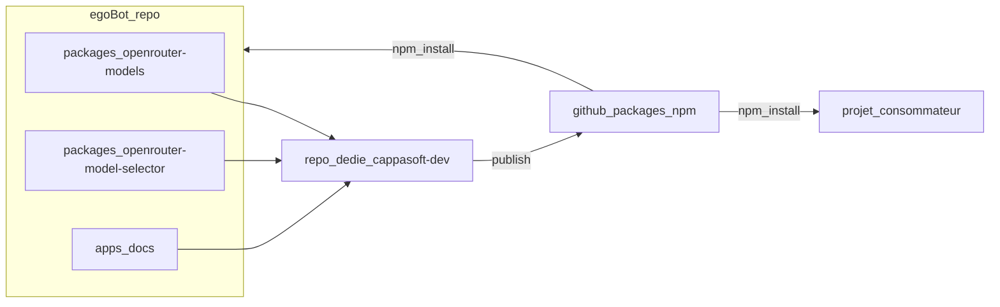

# Feature : Extraction du `ModelSelector` OpenRouter en package réutilisable

## 📅 Date : 05 Janvier 2026

## 📚 Documents associés

- **[Guide d'extraction](../EXTRACTION_GUIDE.md)** : Instructions complètes pour migrer vers le nouveau repo GitHub
- **[Code Review](../CODE_REVIEW.md)** : Review détaillée du code implémenté

## 🎯 Objectif
Extraire le composant `ModelSelector` (sélection de modèles OpenRouter) hors de `egoBot` pour le **réutiliser dans d’autres projets** via des **packages npm privés** publiés sur **GitHub Packages** (orga `cappasoft-dev`), avec :

- un **noyau headless** (service de récupération + cache + grouping/filtering) réutilisable partout
- une **implémentation UI** prête à l’emploi (Shadcn/Tailwind/Radix) consommant le headless
- un mode **BYOK navigateur** : le projet consommateur fournit la **clé OpenRouter**
- une **documentation dédiée** (docs + exemples)

---

## 📌 Contexte (état actuel dans egoBot)

Aujourd’hui, `egoBot` contient :

- **UI** : `src/components/ui/model-selector.tsx`
- **Récupération modèles** : `src/hooks/useOpenRouterModels.ts`
  - fait un `fetch('https://openrouter.ai/api/v1/models')`
  - met en cache via `localStorage`
  - construit catégories / recommended models / filtres

Les imports utilisent des alias `@/` et des composants UI internes (`@/components/ui/*`), ce qui rend la copie brute fragile.

---

## ✅ Décisions de conception (architecture cible)

### 1) Architecture hybride : headless + UI
On vise une séparation nette :

1. **Package headless** `@cappasoft-dev/openrouter-models`
   - Types : `OpenRouterModel`, `ModelCategory`, etc.
   - **Service** : `OpenRouterModelsClient` (ou factory `createOpenRouterModelsClient`) pour l’I/O :
     - fetch (endpoint configurable)
     - headers (dont Authorization)
     - cache injectable (**par défaut** : cache auto via `localStorage` si disponible, sinon pas de cache)
   - **Non-React (v1)** :
     - aucun hook exporté, uniquement service + fonctions pures
   - Fonctions pures testables :
     - `filterAndGroup`, `buildCategories`, `formatPrice`, filtres provider/capabilities…

2. **Package UI** `@cappasoft-dev/openrouter-model-selector`
   - `ModelSelector` + `ModelSelectorCompact`
   - Hooks React (si besoin) : ex `useOpenRouterModels(...)` (au-dessus du client headless)
   - UI “opinionated” : Shadcn/Tailwind/Radix + lucide-react
   - Mode **hybride UI** (v1) :
     - par défaut, le package embarque une UI complète (plug-and-play)
     - optionnellement, le consommateur peut **injecter/remplacer** certains composants UI (avancé)
   - Internationalisation :
     - multilingue **FR/EN** fourni par défaut
     - `locale?: 'en' | 'fr'` (optionnel)
     - par défaut : **langue du navigateur** si disponible, sinon fallback `en`
     - `labels?: Partial<Labels>` (override merged au-dessus des labels par défaut)
   - Le composant UI consomme `@cappasoft-dev/openrouter-models`

### 2) BYOK navigateur (clé OpenRouter fournie par le consommateur)
Le projet consommateur doit pouvoir fournir une clé, sans que le package “décide” où elle est stockée.

API proposée :
- `ModelSelector({ apiKey: string, ... })` (v1, requis)

Note : l’UI v1 expose uniquement `apiKey` pour rester simple. Si on a besoin plus tard de headers additionnels (ex: exigences proxy, ou headers recommandés par OpenRouter), on les ajoutera côté headless.

Notes :
- En BYOK navigateur, la clé est **forcément exposée au front** (normal pour BYOK).
- Interdiction de logger la clé, et **ne pas persister** la clé par défaut (le projet consommateur gère).
- `apiKey` est **requise** en v1 : si elle manque, le composant doit afficher une erreur claire (ex: “OpenRouter API key required”).

### 3) Tailwind dans un package : stratégie “sans piège”
Les classes Tailwind dans `node_modules` peuvent ne pas être incluses par le build Tailwind du consommateur.

Stratégie recommandée :
- **Option A (par défaut, recommandée)** : le package UI fournit un `dist/styles.css` (pré-build) que le consommateur importe explicitement.
- **Option B (fallback)** : documenter l’ajout du chemin du package dans `tailwind.config.js -> content` si le consommateur préfère générer les styles via son propre pipeline Tailwind.

---

## 🧱 Structure cible (repo de publication)

Repo dédié (orga `cappasoft-dev`) en monorepo :

- `packages/openrouter-models/` (headless)
- `packages/openrouter-model-selector/` (UI)
- `apps/docs/` (docs)

Exports npm :
- `@cappasoft-dev/openrouter-models`
- `@cappasoft-dev/openrouter-model-selector`

---

## 🔌 API publique (proposée)

### Package headless : `@cappasoft-dev/openrouter-models`

- `createOpenRouterModelsClient(options)`
  - `apiKey: string` (requis)
  - `endpoint?: string` (par défaut : `https://openrouter.ai/api/v1/models`)
    - si `endpoint` est custom (proxy), il doit rester compatible avec OpenRouter :
      - accepter `Authorization: Bearer <apiKey>`
      - retourner le même JSON que OpenRouter `/models` : `{ data: OpenRouterModel[] }`
  - `fetcher?: typeof fetch`
  - `cache?: { get(key): string|null; set(key, value): void; ttlMs?: number }`
    - si non fourni : **cache auto** via `localStorage` (si disponible) avec TTL, sinon pas de cache
    - TTL par défaut recommandé : **1h** (aligné avec le comportement actuel dans egoBot)
    - clé de cache recommandée : `openrouter_models_cache_v1`

Headers (recommandé) :
- `Authorization: Bearer <apiKey>` (requis)
- `HTTP-Referer` et `X-Title` (recommandés par OpenRouter) :
  - en contexte navigateur, ils peuvent être dérivés automatiquement (`window.location.origin`, `document.title`)

#### Exemple : endpoint proxy compatible OpenRouter (Express)

Objectif : exposer un endpoint interne (ex: `/api/openrouter/models`) qui **relaye** vers OpenRouter et renvoie **le même JSON** (`{ data: [...] }`).

```ts
import express from 'express'

const app = express()

app.get('/api/openrouter/models', async (req, res) => {
  const authorization = req.header('authorization') // attendu: "Bearer sk-or-v1-..."
  if (!authorization) return res.status(401).json({ error: 'Missing Authorization header' })

  const upstream = await fetch('https://openrouter.ai/api/v1/models', {
    headers: {
      Authorization: authorization,
      // Headers recommandés par OpenRouter (optionnels) :
      'HTTP-Referer': req.get('origin') ?? 'http://localhost',
      'X-Title': 'My App',
    },
  })

  const json = await upstream.json()
  return res.status(upstream.status).json(json) // doit inclure { data: [...] }
})
```

Puis côté UI :

```tsx
<ModelSelector
  apiKey={userProvidedOpenRouterKey}
  endpoint="/api/openrouter/models"
  value={model}
  onValueChange={setModel}
/>
```

- API de référence (à stabiliser en v1) :

```ts
export interface OpenRouterModelsClient {
  listModels(): Promise<{
    models: OpenRouterModel[]
    categories: ModelCategory[]
    lastUpdated: number | null
  }>

  /** Force un refetch en ignorant le cache. */
  refresh(): Promise<{
    models: OpenRouterModel[]
    categories: ModelCategory[]
    lastUpdated: number | null
  }>
}
```

- exports :
  - `RECOMMENDED_MODELS`
  - types `OpenRouterModel`, `ModelCategory`
  - helpers `formatPrice`, `filterAndGroup`, etc. (si utiles)

### Package UI : `@cappasoft-dev/openrouter-model-selector`

- `useOpenRouterModels({ apiKey, ...options })` (hook React au-dessus du client headless)
  - retourne `{ models, categories, isLoading, error, refresh, ... }`
  - options utiles :
    - `endpoint?: string` (par défaut : OpenRouter). Permet de pointer sur un proxy interne si besoin.
  - cache :
    - **automatique en v1** (pas de configuration exposée côté UI)

- `ModelSelector(props)`
  - `value: string`
  - `onValueChange(value: string): void`
  - `apiKey: string` (BYOK navigateur, requis)
  - `endpoint?: string` (par défaut : OpenRouter). Permet de pointer sur un proxy interne si besoin.
  - `locale?: 'en' | 'fr'` (optionnel, défaut = langue navigateur, fallback `en`)
  - `labels?: Partial<Labels>` (voir structure ci-dessous)
  - `components?: Partial<UIComponents>` (optionnel) : injection/remplacement de composants UI
  - props UI existantes (search, pricing, filters, modal, compact…)

- `ModelSelectorCompact(props)`

Structure recommandée des `components` (v1) :

```ts
export interface UIComponents {
  Button: React.ComponentType<any>
  Input: React.ComponentType<any>
  Select: React.ComponentType<any>
  SelectTrigger: React.ComponentType<any>
  SelectValue: React.ComponentType<any>
  SelectContent: React.ComponentType<any>
  SelectItem: React.ComponentType<any>
  Dialog: React.ComponentType<any>
  DialogTrigger: React.ComponentType<any>
  DialogContent: React.ComponentType<any>
  DialogHeader: React.ComponentType<any>
  DialogTitle: React.ComponentType<any>
}
```

Stabilité API (SemVer) :
- `components` fait partie de l’API publique.
- On peut **ajouter** de nouvelles clés à `UIComponents` en **MINOR**.
- On ne **renomme/supprime** des clés qu’en **MAJOR**.
- Les props sont volontairement en `any` : le composant passe les props “best-effort” vers vos composants injectés.

Structure recommandée des `labels` (v1) :

```ts
export interface Labels {
  placeholder: string
  loading: string
  searchPlaceholder: string
  noResults: string
  refreshTitle: string
  lastUpdatedPrefix: string
  clearFilters: string
  libraryTitle: string
  showAllModelsTitle: string
  showDetailsTitle: string
  modelDetailsTitle: string
  noDescription: string

  // Capability labels
  capabilityFast: string
  capabilityPowerful: string
  capabilityReasoning: string
  capabilityCheap: string

  // Badge labels
  badgeFast: string
  badgePowerful: string
  badgeReasoning: string
}
```

Labels par défaut (v1) :

- `defaultLabelsEN: Labels`
- `defaultLabelsFR: Labels`

Résolution des labels (recommandé) :
- le composant choisit `defaultLabelsEN`/`defaultLabelsFR` selon `locale`
- puis merge `labels` par-dessus (override)

Résolution de la locale (recommandé) :
- si `locale` est fourni : utiliser cette valeur
- sinon, si contexte navigateur :
  - utiliser `navigator.languages` puis `navigator.language`
  - si la langue commence par `fr` (ex: `fr`, `fr-FR`, `fr-CA`) ⇒ `fr`
  - sinon ⇒ `en`
- sinon (SSR / contexte non-browser) ⇒ `en`

---

## 🧪 Validation & Qualité

### Tests unitaires (headless)
- `filterAndGroup` (grouping + ordering)
- `formatPrice`
- cache TTL
- “recommended only” vs full catalog
- headers (Authorization présent et correct)

### Smoke tests
- `apps/docs` affiche :
  - chargement liste
  - recherche
  - filtres provider/capability
  - sélection et `onValueChange`
  - refresh

---

## 📦 Publication : GitHub Packages (npm privé) – `cappasoft-dev`

### Configuration consommateur (doc)
`.npmrc` :
```ini
@cappasoft-dev:registry=https://npm.pkg.github.com
//npm.pkg.github.com/:_authToken=YOUR_TOKEN
```

### Styles (doc)
Option A (recommandée, plug-and-play) :
- importer une fois dans le projet consommateur (ex: dans `main.tsx` ou `index.css`) :
  - `import '@cappasoft-dev/openrouter-model-selector/dist/styles.css'`

Option B (fallback Tailwind content) :
- ajouter le package UI dans la config Tailwind `content` du projet consommateur (chemin exact selon l’outil/build) pour que Tailwind “voie” les classes.

### Auth & droits
- Local : PAT avec `read:packages` (+ `write:packages` si publication depuis machine)
- CI : `GITHUB_TOKEN` (souvent suffisant) avec permissions `packages:write` + `contents:read`

### Gratuit / quotas
GitHub Packages privé est **simple** et **gratuit jusqu’à des quotas** (stockage + bande passante). Il faut surveiller l’usage si beaucoup de CI/consommateurs.

---

## 📚 Dépendances & compatibilité (recommandations)

### Headless (`@cappasoft-dev/openrouter-models`)
- **Peer deps** (recommandé) : aucune (headless v1 = 100% non-React)
- **Deps** : aucune obligatoire, ou des utilitaires légers si besoin (ex: `zod` si vous validez les réponses — optionnel)

### UI (`@cappasoft-dev/openrouter-model-selector`)
- **Peer deps** (recommandé) :
  - `react`, `react-dom`
- **Deps** (recommandé, pour mode plug-and-play) :
  - `lucide-react`
  - `clsx` + `tailwind-merge` (pour remplacer `cn`)
  - composants Radix nécessaires (si UI embarquée), a minima (directs) :
    - `@radix-ui/react-dialog`
    - `@radix-ui/react-select`
    - `@radix-ui/react-slot` (si `Button` utilise `Slot`)

Note : l’objectif v1 est “plug-and-play”. Les décisions `deps` vs `peerDependencies` doivent être documentées (notamment Radix).

---

## 🧭 Stratégie d’exécution recommandée (2 temps)

### Étape A — Préparer dans egoBot
Objectif : itérer vite, valider API/bundling.

- Créer un dossier `packages/` dans egoBot
- Extraire headless + UI + (optionnel) docs
- Valider en local

### Étape B — Copier vers repo dédié `cappasoft-dev/*` et publier
- Copier `packages/*` (+ docs) dans un repo dédié
- Ajouter workflows GitHub Actions
- Publier sur GitHub Packages

### Étape C — Revenir dans egoBot et adopter le package
- Remplacer les imports locaux (`src/components/ui/model-selector.tsx`, `src/hooks/useOpenRouterModels.ts`)
  par :
  - `@cappasoft-dev/openrouter-model-selector`
  - `@cappasoft-dev/openrouter-models`
- Supprimer/archiver le code dupliqué (ou le garder temporairement derrière un flag)

---

## 🧩 Diagramme (flux de travail)



---

## 🗺️ Plan d’implémentation (todos)

### Todo 1 — Design API (headless + UI + BYOK)
- [ ] Définir l’API publique stable (props, i18n `locale`+`labels`, `endpoint`, injection `components`)
- [ ] Cadrer BYOK v1 : `apiKey` requis (UI + headless) + message d’erreur explicite si manquant
- [ ] Définir la stratégie de cache (v1: **auto** ; clé, TTL, invalidation)
- [ ] Définir la stratégie styles (Option A recommandée : CSS packagé)

### Todo 2 — Stage inside egoBot (avant repo dédié)
- [ ] Créer `packages/` dans egoBot
- [ ] Build + smoke tests locaux

### Todo 3 — Extract headless (`@cappasoft-dev/openrouter-models`)
- [ ] Créer `OpenRouterModelsClient` / `createOpenRouterModelsClient`
- [ ] Extraire types + helpers + logique de grouping/filtering
- [ ] Implémenter Authorization (BYOK) si `apiKey`
- [ ] Ajouter tests unitaires Vitest

### Todo 4 — Extract UI (`@cappasoft-dev/openrouter-model-selector`)
- [ ] Porter `ModelSelector`/`ModelSelectorCompact`
- [ ] Supprimer les alias `@/` (imports package)
- [ ] Ajouter `labels` (FR/EN defaults)
- [ ] S’assurer que l’UI accepte `apiKey` (requis) + `endpoint?` + `locale?` + `labels?` + `components?`

### Todo 5 — Styles strategy
- [ ] Mettre en place build CSS packagé (Option A)
- [ ] Documenter Option B (tailwind content)

### Todo 6 — Docs site
- [ ] Créer `apps/docs` (VitePress)
- [ ] Pages :
  - [ ] Installation (GitHub Packages)
  - [ ] BYOK (sécurité + stockage conseillé)
  - [ ] Usage `ModelSelector`
  - [ ] Usage “headless only”
  - [ ] Troubleshooting (CORS, Tailwind, quotas)

### Todo 7 — Publish GitHub Packages
- [ ] Config `changesets`
- [ ] GitHub Actions publish
- [ ] Permissions `read/write packages`
- [ ] Validation publication & install dans un projet consommateur

### Todo 8 — Adopt package in egoBot (après publish)
- [ ] Remplacer les imports locaux par `@cappasoft-dev/*`
- [ ] Retirer/archiver code dupliqué
- [ ] Vérifier que `SettingsPage`, `PlaygroundConfig`, `BehaviorGenerator` fonctionnent toujours

---

## 🔁 Versioning, compatibilité & changements cassants

- Utiliser **SemVer** (MAJOR/MINOR/PATCH) + `changesets`.
- Politique recommandée :
  - **PATCH** : corrections internes, pas de changement d’API
  - **MINOR** : ajout d’API non cassante (props/options nouvelles)
  - **MAJOR** : changement cassant (rename props, comportement de cache, structure des exports)
- Ajouter une section “Migration” dans la doc à chaque MAJOR (ex: `MIGRATION.md`).

## ✅ Critères d’acceptation

### Reuse & API
1. [ ] Je peux installer `@cappasoft-dev/openrouter-model-selector` dans un autre projet.
2. [ ] Le composant fonctionne en BYOK navigateur : je fournis `apiKey` et je vois les modèles.
3. [ ] Le code headless peut être utilisé sans l’UI (fetch + cache + catégories).

### UX / Features
4. [ ] Recherche, filtres, refresh et sélection fonctionnent.
5. [ ] Les labels sont configurables (pas de FR codé en dur).

### Packaging
6. [ ] Les styles fonctionnent (Option A CSS packagé ou Option B documentée).
7. [ ] Le package build en ESM + types TS OK.

### Publication
8. [ ] Le publish sur GitHub Packages (orga `cappasoft-dev`) fonctionne via CI.
9. [ ] La doc explique `.npmrc`, tokens, quotas et troubleshooting.

---

## ⚠️ Risques & mitigations

- **Tailwind in node_modules** : mitigé via CSS packagé (Option A) + doc Option B.
- **CORS / appels OpenRouter** : en BYOK navigateur, dépend du navigateur et de la politique OpenRouter. Prévoir option `endpoint` (proxy si besoin futur).
- **Quota GitHub Packages** : surveiller bande passante si CI très active ; limiter les installs inutiles.

---

## ✅ Recommandations finales (optionnelles, non-bloquantes)

1) **Checklist “Pre-publish” (Todo 7)** :
- [ ] Tester `npm pack` / installation dans un projet vierge (React+Vite) via GitHub Packages
- [ ] Vérifier le bundle (ESM) + types TS (`.d.ts`) + export map
- [ ] Vérifier que `dist/styles.css` est bien publié et importable
- [ ] Vérifier que `apiKey` manquante produit une erreur claire et non silencieuse

2) **Nom du repo dédié (Todo 7)** :
- Fixer un nom explicite sous `cappasoft-dev`, ex:
  - `openrouter-model-selector`
  - `openrouter-models`
  - ou un monorepo unique `openrouter-ui`

3) **Section “Migration from egoBot” (Todo 8)** :
- Documenter le remplacement des imports locaux par `@cappasoft-dev/*`
- Documenter les différences de props si on change l’API (ex: ajout de `apiKey`, `locale`, `endpoint`)

---

## 🚫 Out of scope (v1)

- Support SSR “strict” (Next.js server components, etc.) si la stratégie de cache dépend de `localStorage` (possible en v2 via cache injectable côté serveur).
- Support React Native.
- Gestion multi-providers (OpenAI direct, Anthropic direct) : v1 se concentre sur OpenRouter.
- Persistance de la clé (BYOK) : laissée au projet consommateur (le package ne stocke pas la clé).

---

## 📎 Annexes (exemples docs)

### Exemple (UI)
```tsx
import { ModelSelector } from '@cappasoft-dev/openrouter-model-selector'

export function MySettings() {
  const [model, setModel] = useState('openai/gpt-4o')
  return (
    <ModelSelector
      value={model}
      onValueChange={setModel}
      apiKey={userProvidedOpenRouterKey}
    />
  )
}
```

### Exemple (headless)
```ts
import { createOpenRouterModelsClient } from '@cappasoft-dev/openrouter-models'

const client = createOpenRouterModelsClient({
  apiKey: userProvidedOpenRouterKey,
})

const { models } = await client.listModels()
```


